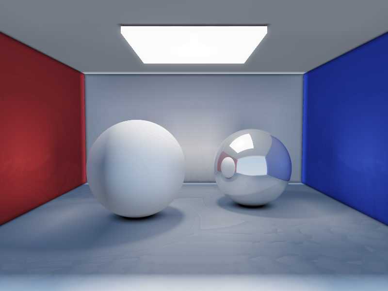
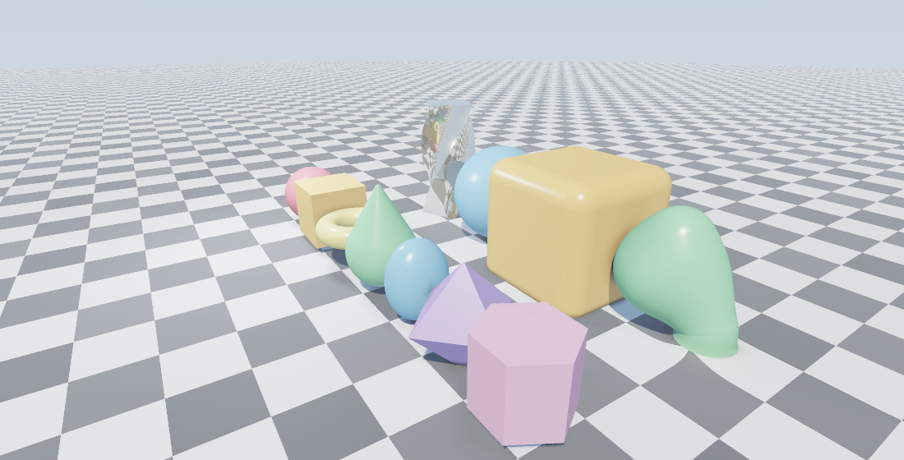
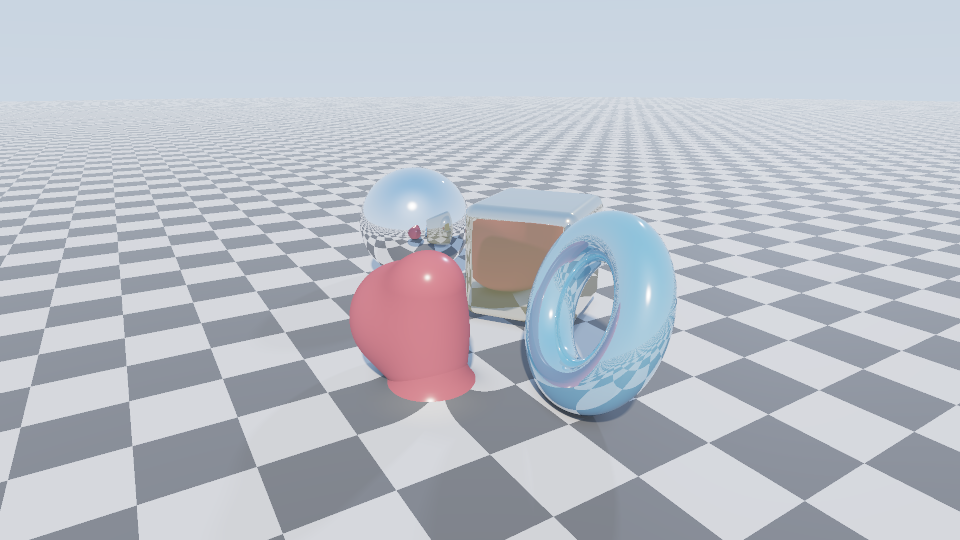

# Atom 3D Engine (MM3E)

A [Lucerna Labs](https://github.com/Lucerna-Labs) project.

This repository owns the renderer libraries and backends. The native editor,
agent authoring tools and editor reproduction fixtures belong to the separate
[Atom 3D Engine Editor](https://github.com/Lucerna-Labs/atom-3d-engine-editor).
See [repository ownership](docs/REPOSITORY_OWNERSHIP.md).

A real-time 3-D engine built from pure math primitives, in std-only Rust. The core
(`mm3e-kit` + `mm3e-orchestrator`) is **dependency-free** — no Vello, no `image`, no math crate, no
windowing crate; it rolls its own vectors, matrices, quaternions, signed-distance fields, sphere
tracer, global illumination, post-processing, animation, scene format, an interactive window, and
24-bit BMP encoder. An optional **GPU backend** (`mm3e-gpu`) compiles the same scenes into a WGSL
compute shader and runs them on wgpu (Vulkan/Metal/DX12) — **698.9 fps at 960×540** on an RTX 5070 Ti,
roughly 400× the CPU path, with a pixel-faithful image.

MM3E is the **3-D elevation of [the Atom Rendering Engine](https://github.com/Lucerna-Labs/atom-rendering-engine)** — where the 2-D engine
rasterized 2-D signed-distance fields with a `scan`-convert, this one sphere-traces 3-D
signed-distance fields. Same eight root atoms, same zero-dependency spirit, same strict
kit/orchestrator split.





*Top: a Cornell-style room with real GI color-bleed (red/blue walls tinting the white sphere),
baked from the SDF probe volume. Middle: PBR metals, emissive bloom, soft shadows. Bottom: the
primitive zoo plus domain operators (twist, onion, round, smooth-union). All pure-math raymarched.*



*Rendered on the GPU (`mm3e-gpu`) from the WGSL-codegen'd world field — the same scene as the CPU
`spheres` example, at 698.9 fps in the current release benchmark.*

## What it is (and isn't)

MM3E is a **best-in-class real-time SDF / raymarching engine + renderer**. Geometry is analytic
signed-distance fields, which makes global illumination, soft shadows, ambient occlusion, and CSG
fall out of the field essentially for free — the things a mesh engine voxelizes or approximates to
fake. It runs on the CPU (multithreaded) and on the GPU (wgpu compute). It deliberately is **not**
a conventional GPU triangle rasterizer like Unreal/Unity/Godot. OBJ meshes enter through a
doctrine-preserving mesh-to-SDF bake and then participate in the same CSG, GI, physics, BVH, and
CPU/GPU rendering paths as analytic fields. See [ROADMAP.md](ROADMAP.md) for the remaining gaps.

## GPU backend

`mm3e-gpu` walks a `Scene` and emits a WGSL compute shader whose `map(p) -> (dist, matId)` is the
GPU twin of the CPU world-field closure — the doctrine re-targeted (the same atoms, now shader text
the GPU runs across thousands of lanes). The camera rides in a uniform, so a fixed scene compiles
once and a real-time loop only re-uploads the camera. Primitives, CSG, domain operators, GGX PBR,
soft shadows, AO, IBL ambient, reflections, and fog are all ported; the core crates stay zero-dep —
wgpu lives only in this crate.

```sh
cargo run -p mm3e-gpu --example gpu_probe  --release   # print the selected GPU adapter
cargo run -p mm3e-gpu --example gpu_render --release   # GPU render to BMP + an fps benchmark
cargo run -p mm3e-gpu --example gpu_viewer --release   # real-time GPU window (Windows; 120 FPS cap)
cargo run -p mm3e-gpu --example game       --release   # playable: roll a ball (GPU + SDF physics)
```

The GPU viewer checks the release feed in the background and never installs silently. Press
`U` to check manually; when a newer version exists, the viewer asks before downloading, verifies
the release archive's SHA-256 digest, and asks again before restarting to apply it. The reusable
`lucerna-release-client` crate and `lucerna-update.json` manifest are framework-neutral so the same
opt-in flow can be embedded in other Lucerna applications.

## Physics + a playable game

`mm3e_orchestrator::physics` is **SDF-native**: the field *is* the collision oracle — `field(p).dist`
is the penetration depth and its gradient is the contact normal — so the GJK/EPA/BVH machinery a
mesh engine needs is closed-form here. `examples/game.rs` (in `mm3e-gpu`) is a real playable demo:
roll a ball around an obstacle course with gravity, jumping, and collisions, rendered on the GPU at
real-time rates — a static level baked into the shader, the player and loose balls simulated against
its distance field and unioned in as dynamic spheres.

## The doctrine

Everything decomposes into the **eight root atoms** and recomposes — *composition over cracking*:

`scan · hash · fold · project · scale · compare · combine · order`

Sphere tracing is `fold` (reduce ray steps to a hit); every SDF is `compare` (a distance); the GGX
BRDF, fog, smooth-min CSG, and bloom are all `combine`; the camera basis and every normal are
`project`. See [ARCHITECTURE.md](ARCHITECTURE.md).

## Architecture — two crates, strictly split

- **`mm3e-kit`** — *all mechanism, no policy.* The atoms, math (`vec`), SDF primitives + CSG +
  domain operators (`sdf`), the pinhole `camera`, the sphere tracer (`march`), light-transport
  math (`shade`), `color`/`Material`, and the `framebuffer`. Nothing here decides *what* to draw.
- **`mm3e-orchestrator`** — *all policy, no mechanism.* The scene graph, the world-field closure,
  lighting, reflections, fog, GI baking (`gi`), the post stack (`post`), render modes, animation
  (`anim`), and the scene file format (`scene_io`). It drives the kit; it never rasterizes a pixel.

## Features

**Geometry** — 11 analytic SDF primitives (sphere, box, rounded box, torus, cylinder, capsule,
cone, ellipsoid, octahedron, hex prism, plane); CSG union/intersect/subtract + smooth variants;
domain operators (round, onion, elongate, infinite repeat, twist, bend, mirror); conservative
bounding-sphere pruning of the world field; OBJ mesh ingestion through mesh-to-SDF baking with a
std-only `.sdfv` cache so imported geometry can be baked once and reused as a normal field.

**Shading & lighting** — Cook-Torrance GGX PBR (metallic-roughness); diffuse image-based lighting
from the sky; **SDF global illumination** (baked irradiance probe volume); directional + point +
**area/sphere lights** with inverse-square falloff and soft shadows; recursive mirror reflections;
gradient normals; ambient occlusion; HDR sky + sun; distance fog.

**Pipeline** — linear-HDR scene-color target → post pass (bloom, exposure, ACES tone-map, gamma);
supersampled anti-aliasing; debug AOVs (normals, depth, AO, albedo, march-step heatmap);
multithreaded rendering via scoped std threads (deterministic, ≈11× on 24 cores).

**Systems** — keyframe animation with easing and quaternion slerp; a `.mm3e` text scene format
(serializer + parser, round-trip tested); a real-time interactive viewer (raw Win32/GDI, no crate).

**Engineering** — 19-test suite, GitHub Actions CI (fmt + clippy `-D warnings` + build + test on
Linux & Windows), zero external dependencies.

## Run

```sh
cargo run -p mm3e-orchestrator --example spheres    --release   # hero scene
cargo run -p mm3e-orchestrator --example showcase   --release   # every primitive + CSG mode
cargo run -p mm3e-orchestrator --example gallery    --release   # primitive zoo + domain ops
cargo run -p mm3e-orchestrator --example gi_demo    --release   # global illumination color bleed
cargo run -p mm3e-orchestrator --example aov        --release   # debug passes (normals/steps/…)
cargo run -p mm3e-orchestrator --example scene_file --release   # write + load a .mm3e scene
cargo run -p mm3e-orchestrator --example animate    --release 24 # 24 animation frames
cargo run -p mm3e-orchestrator --example mesh_demo  --release   # OBJ -> baked .sdfv -> render
cargo run -p mm3e-orchestrator --example viewer     --release   # live interactive window (Windows)
```

Each renderer writes a `.bmp` next to the workspace and prints its absolute path. The viewer opens
an orbit-able window — arrow keys or left-drag to orbit, `W`/`S` to zoom, `Esc` to quit.

## Scene format

`scene_io::serialize` / `parse` read and write a line-oriented `.mm3e` document — settings, camera,
materials, lights, and objects (primitive + transform + CSG mode + domain modifiers). Editing a
scene no longer means recompiling Rust:

```
size 800 450
sun 0.5 0.7 0.4
cam 0 0.8 8  0 0.8 0  0 1 0  50
mat 1 1 1 0 0.6 0 0.15 0 0 0 1          # checkered floor
mat 0.95 0.72 0.28 1 0.18 0.5 0.5 0 0 0 0   # gold metal
obj plane 0 1 0 0 pos 0 0 0 basis 1 0 0 0 1 0 0 0 1 scale 1 mat 0 combine union
obj sphere 1 pos -1.4 1 0 basis 1 0 0 0 1 0 0 0 1 scale 1 mat 1 combine union
```

## Documentation

- [ARCHITECTURE.md](ARCHITECTURE.md) — the two crates, the eight atoms, data flow, module map.
- [ROADMAP.md](ROADMAP.md) — honest competitive gap analysis and the path forward (GPU, meshes).
- [CHANGELOG.md](CHANGELOG.md) — release history.

## License

MIT — see [LICENSE](LICENSE).
