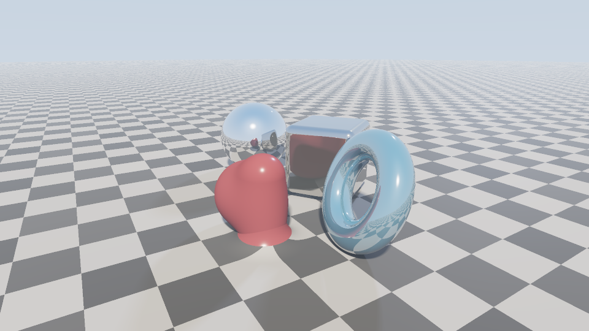
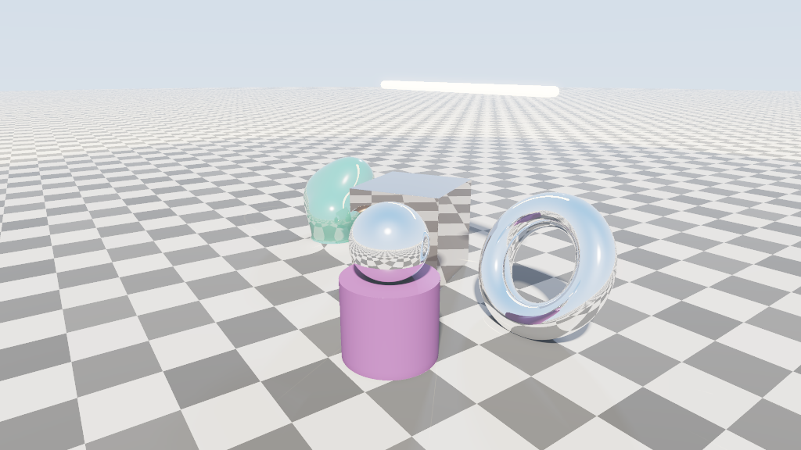

# MM3E — Mechanical Math 3-D Engine

A **robust, dependency-free 3-D renderer** built from pure math primitives, in std-only Rust.
No GPU, no Vello, no `image`, no math crate — it rolls its own vectors, matrices, signed-distance
fields, sphere tracer, shader, framebuffer, and 24-bit BMP encoder.

MM3E is the **3-D elevation of MMPE** (the 2-D "mechanical math primitive engine"). It is
built with the *same techniques*, one dimension up:




*Above: rendered by the examples below. Mirror/Fresnel reflections, soft shadows, ambient
occlusion, CSG (incl. a sphere carved out of the copper box), smooth-min blobs, an emissive
light bar, a procedural checker floor, HDR sky, and distance fog — all from pure-math 3-D SDFs,
no GPU and no external crates.*

| MMPE (2-D) | MM3E (3-D) |
|---|---|
| 2-D signed-distance fields | 3-D signed-distance fields (sphere, box, torus, cylinder, capsule, plane) |
| `scan_convert` over the pixel grid | **sphere tracing** (ray marching) over the pixel grid |
| analytic AA via `smoothstep` coverage | **supersampled** AA on an n×n sub-pixel grid |
| Porter-Duff alpha-over compositing | **CSG** union / intersect / subtract / smooth-min |
| painter's algorithm (`order` atom) | nearest-surface depth from the march + light ordering |
| `Affine` 2-D transform | `Transform` = `Mat3` rotation + translation + uniform scale |
| self-rolled BMP + bitmap font | self-rolled BMP (framebuffer carried over verbatim) |

## The doctrine (unchanged)

Everything decomposes into the **eight root atoms** and recomposes — *composition over cracking*:

`scan · hash · fold · project · scale · compare · combine · order`

In 3-D they specialize as: `scan` walks the pixel grid into rays · `hash` drives the procedural
checker floor · `fold` reduces ray steps to a hit and folds objects into the world field ·
`project` is every dot product (camera basis, normals, lighting) · `scale` is normalization and
the perspective spread · `compare` is every SDF (a distance) · `combine` is lighting, fog, and the
smooth-min blend · `order` sorts the lights brightest-first.

## Architecture — two crates, strictly split

- **`mm3e-kit`** — *all mechanism, no policy.* The atoms + 3-D math (`vec`), SDF primitives and
  CSG combinators (`sdf`), the pinhole `camera`, the sphere tracer with normals / soft shadows /
  ambient occlusion (`march`), the light-transport math (`shade`), `color`/`Material`, and the
  `framebuffer`. Nothing here decides *what* to draw.
- **`mm3e-orchestrator`** — *all policy, no mechanism.* The scene graph (`Object`/`Prim`/`Combine`),
  materials, lights, atmosphere, the world-field closure the kit marches, and the parallel render
  loop. It drives the kit; it never computes a distance, normal, or tone-map itself.

## Features

- Exact analytic 3-D SDFs + constructive solid geometry (incl. polynomial smooth-min blends)
- Sphere tracing with distance-relaxed tolerance and **conservative bounding-sphere pruning**
  (an O(1) lower-bound early-out — the first acceleration step toward a full BVH)
- Gradient normals (tetrahedron sampling), **soft shadows**, **ambient occlusion**
- **Cook-Torrance GGX PBR**: metallic-roughness workflow (GGX NDF + height-correlated Smith
  visibility + spectral Schlick Fresnel), energy-conserving diffuse
- **Recursive mirror reflections** (configurable bounce depth)
- Procedural checkered floor, HDR sky with a sun disk, exponential distance fog
- **Linear-HDR pipeline**: a float scene-color target resolved through a real post pass —
  **bloom** (bright-pass + separable Gaussian), **exposure**, **ACES** tone-map, gamma
- Supersampled anti-aliasing
- **Multithreaded** rendering via scoped std threads (≈11× on 24 cores) — still zero dependencies

## Run

```sh
cargo run --release -p mm3e-orchestrator --example spheres     # hero scene
cargo run --release -p mm3e-orchestrator --example showcase    # every primitive + CSG mode
cargo run --release -p mm3e-orchestrator --example turntable 12 # 12 orbiting frames
```

Each example writes a `.bmp` next to the workspace and prints its absolute path.
(`spheres.bmp`, `showcase.bmp`, `turntable_NN.bmp`.)
