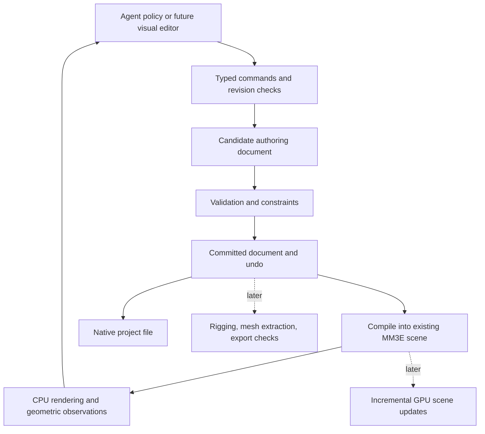

# An agent-operated character editor: principles, evidence, and design

Subsequent implementation: [animation capabilities](AGENT_EDITOR_ANIMATION.md) now provide
named clips, rigid joint hierarchies, camera animation and rendered sequences. The report
below preserves the findings and delivered scope of the original first-layer pass.

Research and implementation pass: 2026-09-06. The objective is an engine and editor that let AI
agents create, inspect, modify, and refine 3D objects, especially characters, with useful quality
feedback and efficient iteration. The user selected exploration followed by implementation of
the first working agent-control layer. Character style remains open; the first acceptance asset
is a humanoid blockout that exercises the interface.

The central design proposal is **a durable, structured authoring document with reversible
operations and a measurement loop**. The engine evaluates geometry and renders observations.
Agents and a future visual editor use the same operations on that document. This preserves
intent and intermediate work while allowing different policies, models, interfaces, and
rendering backends to participate.

This is a broad cross-domain exploration, not a claim to have exhausted every discipline.
Established mechanisms are distinguished from proposed transfers. A promising analogy is a
candidate for an experiment, not evidence that the transfer improves this engine.

**What the repository actually provides**

The source root is the inner `atom-3d-engine-main` directory. This checkout has no `.git`
metadata. Source inspection and live tests take precedence over the old README/roadmap claims.

| Existing component | Useful foundation | Consequence for this editor |
|---|---|---|
| `mm3e-kit`: primitives, field operations, transforms, cameras, tracer, dual numbers | Compact, composable shape construction and direct mathematical queries | Preserve the kit as mechanism; authoring policy composes it |
| `mm3e-orchestrator`: `Scene`, ordered object fold, materials, lighting, AOVs | Already turns authored data into real pixels | Compile editor documents into this scene instead of adding a separate renderer |
| `Scene::field()` and acceleration bounds | Efficient rendering lower bounds | These values can differ from the authored scalar far from geometry; they are unsuitable as an unqualified measurement API |
| Flat `Vec<Object>` and global CSG order | Simple renderer input | No persistent identity, transform parenting, or independent CSG groups existed in the authoring layer |
| `.mm3e` text writer | Existing analytic scene interchange | It explicitly omits volume objects and does not serialize all marcher controls; it cannot be used as a lossless editor project snapshot |
| OBJ-to-SDF baking and `.sdfv` data | Imported shape can participate in the engine's field pipeline | Preserve the baked data on save; acknowledge that this conversion does not retain original topology, UVs, or material assignments |
| Keyframe interpolation and rigid/particle physics | Useful animation and simulation mechanisms | These do not constitute a character skeleton, skinning, IK, facial rig, or deformation-quality system |
| GPU shader generation | Existing optional rendering backend | Inspect compilation and parameter update costs before committing an interactive editor to recompiling shaders for each edit |
| Windows-specific example viewers | A presentation path exists on Windows | The first Linux-operable layer is headless; a cross-platform visual editor remains future work |
| Existing cross-domain experiments | Some candidates retain failed geometric checks alongside performance measurements | Reuse that experimental discipline; do not promote a raw speed result whose silhouette/depth error failed acceptance |

The core baseline was **63 passing tests** in the kit and orchestrator. The first offline Cargo
attempt failed because an updater dependency was missing from the cache; an ordinary network
attempt failed DNS. Fetching the workspace's declared dependencies with network permission
resolved that boundary, after which the actual Cargo tests ran. Old GPU FPS and TPU experiment
numbers were not revalidated in this pass.

**First principles and the barriers they address**

An agent needs controllability (an operation can express the intended change), observability
(the resulting state and defects can be measured), and recoverability (a poor change can be
reversed). More tools alone do not establish any of these. Thousands of low-level vertex edits
can still be a poor action space; a beauty render alone can still conceal errors; a successful
command can still produce an unusable asset.

The following transfers are design inferences. Their cited sources support the underlying
mechanism; they do not claim to validate the proposed MM3E transfer.

| Domain | Underlying principle and source | Proposed editor use | Test that would justify keeping it |
|---|---|---|---|
| Compiler construction | Preserve high-level meaning while lowering into executable representations. [MLIR rationale](https://mlir.llvm.org/docs/Rationale/Rationale/) | Character intent → semantic parts and constraints → SDF operations → CPU/GPU scenes. Preserve IDs and a path back to the authored control. | Change chest width and verify unrelated parts remain identical; compare backend geometry and image outputs |
| Database systems | A change is either fully committed or absent; durable replacement protects prior state. [SQLite atomic commit](https://www.sqlite.org/atomiccommit.html) | Revision checks, atomic edit batches, dry runs, undo, staged saves | Reject a batch halfway through, kill/reopen around save tests, and detect stale revisions without duplicate edits |
| Robotics and feedback control | Repeated observation and replanning turn a plan into feedback. [MIT trajectory optimization](https://underactuated.csail.mit.edu/trajopt.html) | Observe → propose bounded edit → evaluate → accept or undo → repeat | Reach a requested landmark tolerance using measurements from the actual engine; count evaluations and regressions |
| CAD and constraint solving | Relations can define geometry more directly than independent coordinates. [SolveSpace technology](https://solvespace.com/tech.pl) | Equal limb lengths, attached joints, eye spacing, bilateral symmetry, clearance and contact constraints | Satisfy feasible constraints and explain conflicting constraints; never silently relax an authored requirement |
| Information theory and Bayesian optimization | Choose expensive evaluations by expected information gain. [Entropy Search](https://www.jmlr.org/papers/v13/hennig12a.html) | Choose the next camera, pose, or parameter probe where uncertainty about a defect is greatest | Detect hidden defects with fewer renders than a fixed-view baseline; include cases where adaptive selection misses a defect |
| Signal processing | Sampling resolution and reconstruction affect the detail that can be observed. [PBRT sampling and reconstruction](https://www.pbr-book.org/4ed/Sampling_and_Reconstruction) | Coarse-to-fine shape edits, pixel-footprint tolerances, explicit preview versus final checks | Compare silhouettes, thin structures, normals, and depth against tighter render tolerances at equal cost |
| Numerical analysis | Sphere-tracing guarantees depend on valid distance bounds. [Hart's sphere-tracing paper](https://graphics.stanford.edu/courses/cs348b-20-spring-content/uploads/hart.pdf) | Track exact SDF, bounded estimate, sampled field, and uncertified warp as distinct capabilities | Adversarial rays near thin features and deformations; include bounds tests and measured numerical error, not just attractive screenshots |
| Inverse problems | Rendering parameters can be optimized against observations when useful derivatives exist. [Mitsuba gradient-based optimization](https://mitsuba.readthedocs.io/en/latest/src/inverse_rendering/gradient_based_opt.html) | Fit proportions, lighting, or materials to reference views under explicit constraints | Reduce held-out multiview error; compare gradients with finite differences and record visibility discontinuities |
| Metrology | A measurement needs a defined quantity, method, and uncertainty. [NIST measurement uncertainty](https://www.nist.gov/itl/sed/topic-areas/measurement-uncertainty) | Report units, scope, sample resolution, tolerance, scene revision, and whether a scalar is a Euclidean distance | Ensure an overlapping arm cannot be mistaken for a chest measurement; distinguish an empty field from a finite measurement |
| Developmental biology and grammars | Repeated local production rules can encode complex branching structures. [Algorithmic Botany](https://algorithmicbotany.org/papers/) | Parameterized body plans and appendage grammars; preserve local controls through expansion | Generalize from a biped to different limb counts without rewriting low-level geometry commands |
| Program synthesis and learned abstractions | Reusable programs can compress recurring solutions. [DreamCoder](https://arxiv.org/abs/2006.08381) | Promote successful, validated hand/ear/limb construction sequences into parameterized recipes | Measure success on held-out character briefs and editability; avoid a library that merely memorizes the training examples |
| Differential geometry and variational methods | Smooth, localized influence functions can be solved under constraints. [Bounded biharmonic weights](https://igl.ethz.ch/projects/bbw/) | Bones, cages, and point handles with feature-preserving deformation weights | Pose sweeps for collapsing joints, volume loss, leakage between parts, and protected eye/mouth regions |
| Continuum mechanics | Geometric constraints and material energies can support stable deformation solvers. [Projective Dynamics](https://users.cs.utah.edu/~ladislav/bouaziz14projective/bouaziz14projective.html) | Later skin, clothing, hair, and secondary motion; local projection/global solve candidates | Equal-time comparisons of stretch, penetration, temporal stability, and iteration cost |
| Computational topology | A visually plausible surface can still have invalid connectivity or self-intersections. [CGAL polygon processing](https://doc.cgal.org/latest/Polygon_mesh_processing/index.html) | Explicit mesh checks and localized repair after field-to-mesh extraction | Closedness/orientation checks when required; detect intersecting triangles and preserve semantic boundaries during repair |
| Implicit geometry and discretization | Surface extraction can use both intersections and normals. [Dual Contouring](https://graphics.stanford.edu/courses/cs164-10-spring/Handouts/paper_p339-ju.pdf) | Exportable mesh derived from authored fields, retaining source provenance | Bound shape and normal error; test thin appendages and sharp features; separately assess animation topology |
| Rasterization and boundary ownership | A half-open edge rule assigns a shared boundary once. [DirectX ray-tracing specification](https://microsoft.github.io/DirectX-Specs/d3d/Raytracing.html) | Apply projected triangle ownership to mesh-to-SDF parity crossings | Bake triangulated cubes and sample interiors on shared diagonals; reverse winding and test shared vertices |
| Perception and psychophysics | Structural image similarity measures capture some distortions that pixel error misses. [SSIM research](https://www.cns.nyu.edu/~lcv/ssim/) | Add perceptual comparisons to silhouette/depth/normal checks | Compare automated rankings with human assessments; do not equate image similarity with anatomical quality |
| Scene composition and digital content pipelines | Layered descriptions and explicit composition support reusable assets and variants. [AOUSD core specification](https://aousd.org/usd-core-specification/) | Base character, outfit, pose, and material variants as separately editable layers | Isolate a variant change; reload dependencies and verify authored composition rather than flattening away intent |
| Interchange engineering | Animation delivery needs defined joints, weights, and morph data. [glTF specification](https://registry.khronos.org/glTF/specs/2.0/glTF-2.0.html) | A future export gate for meshes, skeletons, skin weights, and expressions | Open the exported asset in an independent consumer and verify geometry, appearance, scale, and pose |

Several other perspectives are useful as **hypotheses to test**, without claiming an established
MM3E result: manufacturing suggests explicit tolerance budgets and defect-local repair;
reliability engineering suggests fault injection and recovery tests; causal inference suggests
changing one mechanism at a time and retaining negative controls; decision theory suggests
spending compute according to expected accepted improvement; software build systems suggest
dependency-aware invalidation; group theory suggests generating symmetry-preserving edits by
construction. These are promising design constraints, not reasons to import whole frameworks.

The eight existing root atoms remain intact: `scan` traverses commands, pixels and probes;
`hash` can identify immutable content; `fold` evaluates ordered fields and reductions; `project`
handles coordinates and constraints; `scale` applies units and transformations; `compare`
implements residual and acceptance checks; `combine` builds geometry and aggregates evidence;
`order` preserves dependencies and CSG semantics. This decomposition does not itself supply
anatomy, valid distance bounds, or a quality guarantee; those require explicit contracts and tests.

**A representation that can grow into a character editor**

Keep the authored document authoritative. A character eventually needs persistent identity,
body-plan structure, landmarks, proportions, symmetry relationships, a rest shape, deformable
surface representation, joints, weights, expressions, materials, attachments, and provenance.
These need different operations and validation. Collapsing them into a single unlabelled scalar
field would discard information needed for subsequent edits.

SDFs remain the native modeling and rendering foundation. They are useful for blockout, smooth
composition, and geometric queries. Meshes can be derived for delivery and deformation work;
that does not require replacing this engine with a triangle rasterizer. A dense extracted mesh
is also not automatically good animation topology. Skeletons and feature correspondence must
remain independently represented. Learned generation may propose geometry, textures, or
recipes, but the resulting artifact should enter the same inspect/edit/validate loop.

This first layer implements a flat document with stable IDs and semantic labels. Group labels
are selection metadata; they do not pretend to be transform parents, skeletons, or isolated
CSG groups. The global authored CSG order is preserved. The richer graph above is the extension
path, not an assertion that it is already implemented.

**Define quality and efficiency as separate, inspectable results**

For a character, keep a vector of outcomes: brief adherence, silhouette, proportions, local
anatomical plausibility, multiview consistency, surface defects, pose deformation, materials,
export correctness, and authoring cost. The style brief determines which anatomical proportions
are relevant. Use hard gates for malformed data and explicit requirements; soft preferences can
be ranked among valid candidates. Do not let a weighted total hide a broken hand behind a good
lighting score.

An example future optimization is `minimize render_cost + action_cost + repair_cost` subject to
the user's explicit constraints and measured error budgets. This is a proposed objective,
not a validated universal fitness function. Record total time, field evaluations, render count,
tool calls, retries, memory, and accepted quality improvement. A low-resolution preview improves
efficiency only if the final gate still detects missing detail and geometric failures.

The first implementation's `validate` covers document validity and renderer lowering. Its
render metrics cover visible material owners, center-ray coverage, image bounds, and reported
march iterations. They do **not** assess anatomy, topology, style, or animation readiness.
Its field values explicitly retain the engine's numerical approximations. Full-quality output
is a rendering preset, not mathematical ground truth.

**Implementation delivered in this pass**

`mm3e-editor` is a real Rust library and JSON-lines executable using the existing CPU renderer.
It provides schema discovery, compact inspection, full document retrieval, atomic batches,
preview validation, stable part IDs, strict revision checks, undo/redo, scene- and object-scoped
sampling, pixel picking, PNG/BMP rendering, native project persistence, OBJ-to-SDF import, and
an editable 19-part humanoid recipe. Serde, schema generation and PNG encoding are confined to
the editor crate; the kit and orchestrator retain their existing dependency boundary.

Two engine queries were added: `Scene::sample_authored` bypasses rendering bounds, and
`Scene::sample_object` observes a part before global CSG. The first character fitting run
exposed a real ambiguity: the combined field at a chest target belonged to an overlapping arm.
Object-scoped observation addresses that failure without changing the measurement target or
silently accepting the arm as the chest. Both scopes are explicitly named in responses.

The OBJ acceptance test also exposed a pre-existing sign defect: a crossing on a shared face
diagonal could be counted twice. The former equal Y/Z nudge preserved that ambiguity on cube
diagonals. The crossing mechanism now lives in the kit and uses f64 projected edge tests with
half-open ownership. The bake queries the actual grid row without that nudge. Tests cover
shared diagonals, reversed winding, shared vertices, small projections, and real cube import
and persistence; this does not certify every malformed or nonmanifold input mesh.

The native project format stores the complete document supported by this layer, including
baked samples. It does not route snapshots through the lossy legacy text writer. The legacy
writer itself was not fixed or replaced; existing `.mm3e` projects are not imported by this
first editor. Undo is limited to 32 session snapshots. File operations are rooted in the chosen
project directory, saves are staged before replacement, and overwrite is explicit. Revision
checks coordinate requests within one process, not competing editor processes on one file.

**Next work in dependency order, with acceptance boundaries**

1. **Geometry and document contracts.** Introduce explicit parent/part relationships, isolated
   CSG groups, version migration, geometric provenance through blends/cuts, crash recovery and
   persistent history. Validate field/warp bounds, malformed input, and independent save/load.
   The existing core's distance approximations and legacy persistence gaps remain audit items.
2. **Character constraints and inspection.** Add landmarks, bilateral operations, relational
   dimensions, pose/contact constraints, part isolation renders, object masks, true depth data,
   and diagnostic regions. A requested arm edit must preserve the wrist attachment or identify
   the violated relation. The solver should explain infeasibility.
3. **Surface and deformation pipeline.** Add field extraction, semantic correspondence,
   skeletons, bind poses, localized weights, joint-limit and deformation tests, and facial
   controls. Use static views and pose sweeps; an intact rest pose is insufficient acceptance.
4. **Efficient authoring and a visual editor.** Profile real edit→compile→render latency;
   separate shader structure from frequently edited parameters; cache by dependency and
   revision. Add a Linux-capable viewport, selection, inspectors, and operation history through
   the same command service. Exercise agent and human changes against the same state.
5. **Material quality, delivery, and autonomous policies.** Add UV/texture/attachment workflows,
   tested interchange, layered variants, reference fitting, reusable recipes, and a planning
   policy. Compare autonomous runs on held-out briefs by independently assessed quality and
   complete workflow cost, including failed attempts.

The first layer establishes operational control and inspectable feedback. A production
character editor still requires the later contracts, deformation work, quality evaluators,
visual interface, and independently verified delivery pipeline.
